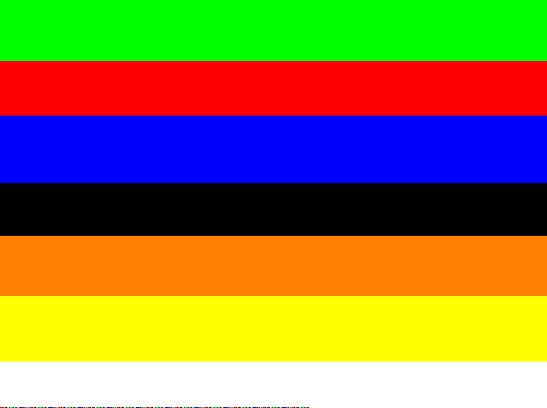
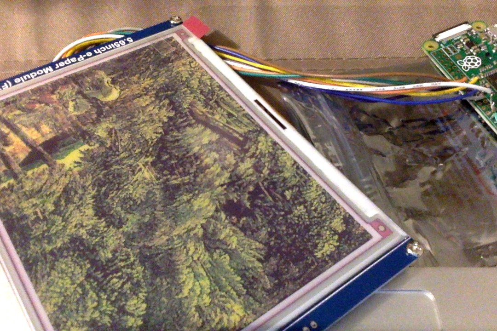
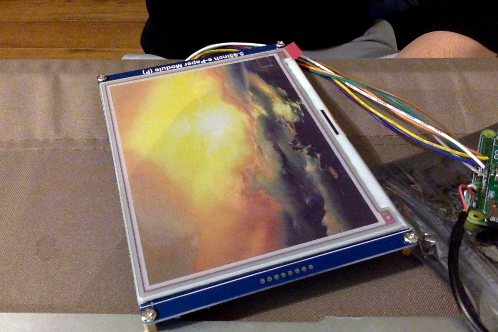
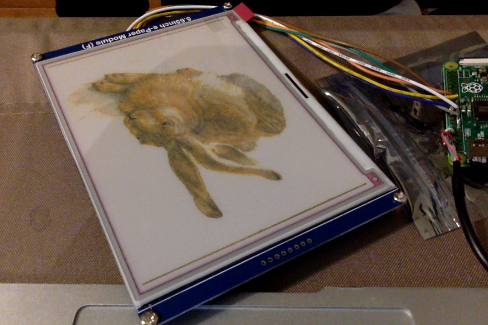
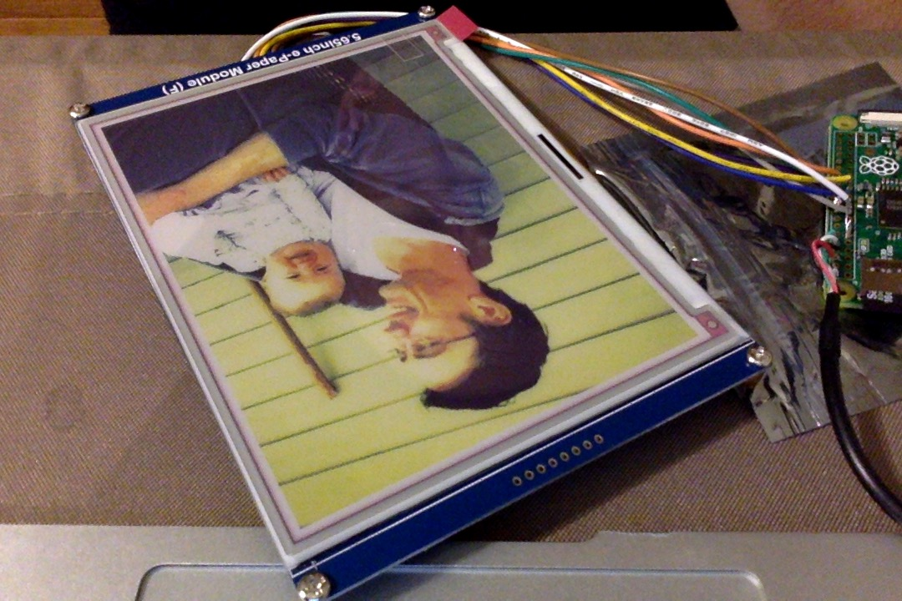
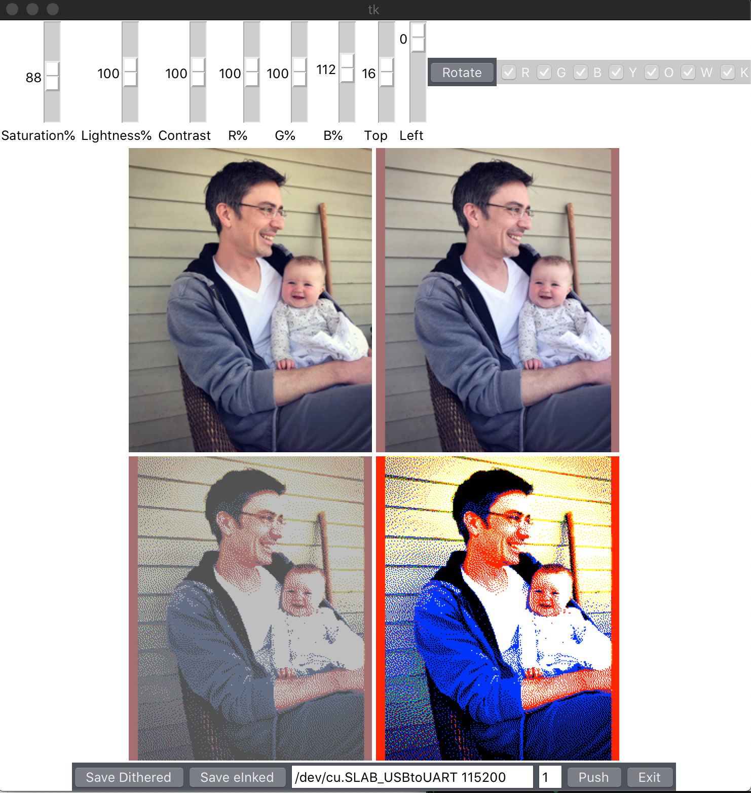
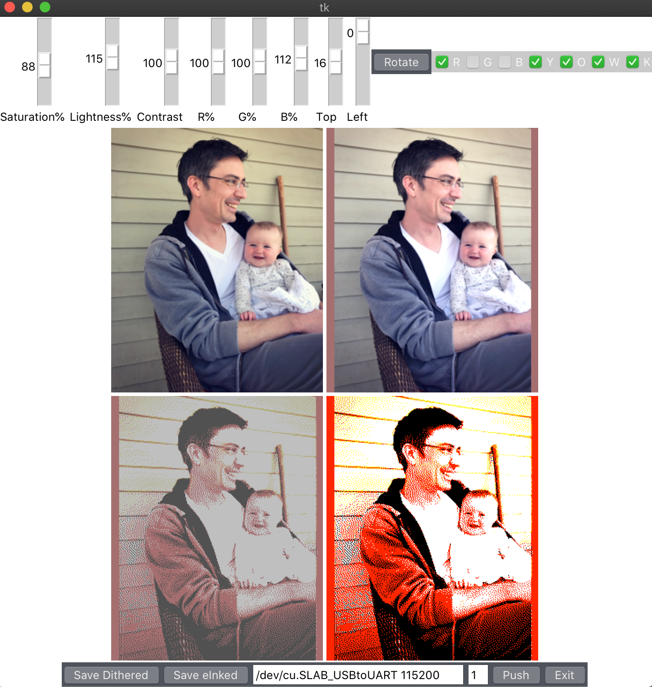

The Story
=========

Broadly, I am very annoyed at being unable to read a screen in direct sunlight.  More specifically I love non-emissive screens.  Aside: I set an alarm for 4am long ago to make sure i got an [OLPC XO](http://one.laptop.org/about/hardware) buy-two/get-one.  Still have that machine, my 3-4 year old loves it -- though i had to get an external [toddler mouse](https://www.amazon.com/ChesterMouse-AbleNet-Chester-Computers-CCT/dp/B004001QTU) since that trackpad is garbage.  To that end I've long been a follower and fan of eink technology, though for a long long time it seemed like dedicated readers were the only viable product for it.  More recently I was particularly interested in the dual screen [yottaphone 3](https://www.theverge.com/circuitbreaker/2017/8/24/16196766/yotaphone-3-specs-release-price) though I never could tell if i could use it states-side.  Ultimately I bought into [LightPhone 2](https://www.thelightphone.com/products) (my first smartphone!) and I'm very happy with it (strong caveat: i came to it from no prior use of smart phones.  i had a complete piece of shit alcatel go flip, so the sluggish response and at times difficult texting experience with light phone 2 were still a vast improvement over what i was used to.  if you are a power-texter you probably will not enjoy the experience.)   

so when [this](https://news.ycombinator.com/item?id=23898523) story popped up on HN about an affordable consumer-facing /seven(!) color/ display (600x448 pixels), i had to jump.  i ordered it despite having almost zero experience hobbying with hardware.  i've built my own computers, i'm a application developer by title, but i've never really dabbled in pin-outs and shit since my aborted undergraduate foray into ComputerE almost twenty years ago.

the display arrived, and i took a look at it.  ribbon cable, screen, not much else.  okay, time to think.  what am i doing, and how will i do it.

ever since digital photo frames hit the market i thought they were a cool idea, but completely ruined by being 1. emissive and 2. corded.  okay, here's my chance to build the product i always wanted.  i'm going to build an unplugged non-emissive digital photoframe.  

i dug into [waveshare's wiki](https://www.waveshare.com/wiki/5.65inch_e-Paper_Module_(F)) (which is great!) and got the notion that a low-powered dedicated microcontroller (am i even using that term correctly?) would be ideal.  but further digging demonstrated that waveshare has resources built and demo scripts written for only a subset of devices.  one of which is raspberry pi.  okay, i would really like to avoid building driver code from scratch or something (i'm lazy!), and the pi is another device i've long watched and always thought was slick sounding but have never had a use for.  pi it is!

looking at the pi options and considering my use case, the raspberry pi zero (no W) was clearly my pick.  least amount of capabilities == least amount of power draw == lowest profile (i want to hide this behind a frame flush to the wall).  but this is also going to mean soldering.  i have soldering kit already, i've done it once before to fix a radio, i made a mess, melted some plastic, but was ultimately succesful.  plus the pi is five bucks, if i fuck it up i can try again.

i don't have a spare screen, nor do i have a monitor with hdmi in/out at all.  i don't want to buy one for this, so what do i do?  well it turns out you can solder a usb adapter direct to the pi to get terminal over serial -- also that cord can supply the pi with power.  fucking sick, i've got my i/o and my power all in one port, this is ideal for my end-product.  i ponder for a while how best to transfer various python libraries and the waveshare code over this serial terminal connection before i decide that for development's sake, i'm going to need wifi at least just for the downloading libraries and dependencies part.  some other blog links me to this powered usb-on-the-go hub which seems ideal for what i'm doing.  time to make my order: pi zero, console cable, an usb-to-mini power cable, some extra wire just in case, powered hub, compatible wifi dongle (well, that i got later, i thought the one i had would work but it didn't).  

first step is soldering on the serial adapter (not the power line yet) and seeing if it boots.  
next step is figuring out how to fucking talk on serial.  i don't have any experience with this.  polyglotdeveloper blog walks me through it.

it lives!

next i try to get it on wifi.  i'm nanoing wpa_supplicant files, limited success, spin up an unprotected guest network just to simplify things and get it going.  works great.  i later realize that raspi-config would have handled this for me, and i then use it to connect to the proper encrypted wifi.

i start working off the waveshare raspi python wiki, downloading software and libraries.  i clone the waveshare repo and fire off the epd_5in65 demo code.  it runs! "epaper busy" well, yeah, i haven't soldered it on yet.  everything looks good. end of night one.

back down into the basement, turn the exhaust on, clipping the female pin ends off the wires, stripping the ends with my fingernails and tinning then soldering the wires directly to the board.  i didn't sequence correctly and ended up having to put one or two wires inbetween wires i'd already done, a tight fit.  my soldering is ugly.  ugly ugly.  but no obvious shorts and no gaps.  

back to the attic, plug it all back in, power up (no fires), terminal in, run the code: it fucking works.  the code cycles through some demo bitmaps and goes to sleep.  phenomenal success, much better than my usual record.  my next trial is figuring out if i can make (and transfer) a .bmp which the code can interpret and display.

I want this 7-color display to show photos and paintings.  At this point I was well aware dithering is in my future.  web-wise i cut my teeth in the geocities days.  using paintshop pro and later a pirated PS (3?) I used to play with indexed palettes and dithering thresholds /for fun/.  i'd spend my time whittling photos down to the smallest file size i could manage while still looking decent.  i regret some of this now, as these early digitizations are some of my only remnants of some images & scans from those days, and i wish that i still had larger resolution files.  oh well.  

anyway, the waveshare wiki offers color tables and says it's super easy, just use photoshop and save for web using their color tables.  but i don't have photoshop anymore.  gimp won't import the color table, but i can make the palette anyway.  take a photo, convert it to an indexed palette with the same color values as the photoshop .act file (if i recall it was just an ascii file with color hex values).  download it over wifi to the pi, point the demo code to the new file and.... nothing.  screen clears and then displays garbage.  there's a hint of the picture in there, but clearly something's gone wrong.  many retries, many failures, ultimately i end up deep in hex editors and stepping offset by offset through the bitmap file spec trying to understand the differences between my .bmp and the demo .bmp.  there are a few things.  the header's a bit different, the palette didn't survive quite right, it's a mess.  i call it a night.

my next go at it, i decide using gimp is just too much overhead and dive into python Pillow. (I actually started in imagemagick which worked great, but decided to try to get all my manipulation into native python -- that said, imagemagick is amazing).  defining your own custom palette in pillow isn't as straightforward as it should be, you have to apparently create an image and then pull the palette from that image.  anyway i get that going and start inspecting the bytes.  still garbage.  the demo .bmp clearly has 6 bytes (2 R, 2 G, 2 B) for each pixel.  mine is showing less, and the palettes all wrong.  after a long, long time i finally realize that 1. it's an indexed palette, my .bmp pixels are index values pointing to the palette and 2. my palette is getting all fucked up because i'm resizing after i palettize which is inserting an RGB conversion or some other operation which is modifying my palette.  probably palette to RGB to resize which changes some color values then back to palette.  i get that order of operations sorted out, and then discover that if i palettize and then convert to rgb i get a file that looks practically identical to the demo bitmap.  it's got a bitmap header and a palette in there, but each pixel is actually defined by 2 bytes each R, G and B.

push that fucker to the screen and it finally fucking works.
(at this point i'm transfering the images via wifi)

but now i'm face to face with a photo that does /not/ look as good as the pre-eink rendering.  what the fuck.  here is when i go deep on dithering.  i figure my problem must be in the dither algo, and it's time to see if anything new has come along.  news: there are new dithers!  on github is a ["hitherdither" repo](https://github.com/hbldh/hitherdither) which can explore something like a dozen+ dithering algorithms, including a couple relatively recent ones.  very excited, i test em out.  super interesting stuff, the new ones were designed [to reduce jitter and maximize color specifically for 8-bit pixel art animations](https://bisqwit.iki.fi/story/howto/dither/jy/#YliluomaSOrderedDitheringAlgorithm1).  well this is all very cool and i am very impressed with hitherdither, but none of this is helping my output.  all of my shit is bedeviled by /too much orange/.  it occurs to me that orange is the only of the 7 colors (red green blue orange yellow black white) which has a middle value, and i start to wonder if my problem lies in the palette.  this is when i start wondering if my problem is dithering in RGB space, when my screen isn't emissive, but instead functions more like print.  is this something about how light mixes in RGB but pigment mixes in RYB?  I modify hitherdither to dither in CMYK space, get that to work, flash it to the screen and: maybe better? but super washed out.  not better really at all...  i go back to the literature and find [a paper](https://pdfs.semanticscholar.org/8345/e65f6ea9f59176c82b05c09fb9d5f6ffb0d9.pdf) which basically describes exactly my situation.  not only does it describe my quest, but also it has a section about "what sounds like it will work but won't" where it talks about dithering in CMYK instead.  it concludes simply: "the best dither is a dither calibrated to the colors of the end medium"

well fuck.  these seven colors are red green blue yellow orange white black.  defined in the color table (so presumably necessary to drive the screen) as FF0000, 00FF00, 0000FF, FFFF00, FF8000, FFFFFF, 000000.  they're the full pure color values.  but e-ink is at the best of times glorified shades of gray.  i need to calibrate!  i flash a bitmap of the seven color palette to the screen, pop the screen off the ribbon and take it over to my trusty scanner, circa 2002.  eink is super cool, i love that i can do this.  i scan it, and take averaged color values and sure enough, the actual values are way, way different.  white is A5B1B1, black is closer to 404040, all the colors are muddled middle gray colors.  i define a new palette in pillow with these values, and at this point i'm comfortable enough with the bitmap file spec that i'm fairly confident after i convert the jpg to an indexed bitmap with my true color palette i can just swap the palette bytes for the idealized (FF0000) palette bytes, then convert to RGB and the indices should pick up the idealized colors and it should be good to go.

see the /img folder on this repo for comparisons between the actual colors and the idealized colors.  (after i took that scan and processed it i realized that the orange being dithered meant i hadn't calibrated correctly yet, and improved it somewhat again.  however the lightness of the black was starting to dominate pictures and i manually tweaked it down to 202020 just to improve output [to encourage more color selection].  more manual tweaks will likely come.)

i get that shit working, the true color (gray colors) dither looks good, the idealized color dither looks wild but good, i flash it to the screen and holy shit the picture looks 100% better.  there's still some finagling to do, so i end up adding a bunch of basic color manipulation to my conversion script.  scalar arguments for the separate R, G, and B channels so i can pump up R and pull down B for example.  Later i add lightness and saturation scalars (pillow is sweet and makes this all super easy!).  a couple more arguments to let me fiddle with the scalars and inspect the expected output image and the idealized color bitmap to avoid problems before pushing to the screen (refreshing the screen takes approximately one half of an eternity) and i feel like a whiz.

i should say that after investigating all those fancy dithers, turns out the old standby floyd-steinberg is just still the best for photos.  there was one other contender: sierra2-4a.  but the fancy new ones were designed for a different use-case: 8bit animated art.

i've run a bit ahead of the part where i had to figure out how to push data over the serial port.  while developing i figured out that i could push data using GNU screen's "readreg" and "paste" commands.  had to be ascii though.  so my python pipeline at this point is taking the image, dithering on true color, swapping into idealized color, zipping the file, base64ing the zipped file, then breaking up the base64 with a newline every ~4000 characters.  i was originally doing that all with unix utilities and before i split every 4k characters i bricked my pi, i presume with a buffer overflow.  when i first tried to send the whole base64 string over one "paste" the pi went non-responsive and wouldn't boot back up.  apparently there's a 4096 char limit on what one line can take (in gnu screen?), pasting in 70k characters in one line did bad things.  i reimaged the pi, reinstalled everything and got back to work, "fold" on the command line broke up the b64 string for me and once i proved i could transfer that way i moved everything (except "readreg" and "paste") into python.

i knew i was going to have to figure out how to automate pushing this data over the serial line.  this was frightening because so far the serial line was my terminal, and if i repurposed it to data transfer i wouldn't have a terminal anymore.  i was imagining i'd have to swap the config.txt to enable/disable terminal over serial each time i wanted to check my error output as i developed, which would have been more than tedious.  i discovered then that i could just ssh in for a terminal (a more fully featured terminal in fact, plus one that supports X11, so i could actually use a gui text editor (geany) instead of nano! it was amazing. i turned off terminal over serial, and started learning how to send data over serial.  now the dream end product here is: "i plug in the usb cord, the pi boots up on power over the usb, then starts slurping the data i push, on finish it flashes the data as bitmap to the screen and powers down."  there's some very helpful , very simple pyserial demo code which demonstrates simple talking over serial.  the two main read functions are read(n) and readline().  read just listens until n bytes are read, readline reads until a specific character is read (newline \n).  there's a timeout argument which will allow the read to give up if it hasn't found the bytecount or character it's looking for in a certain amount of time.  i spent a /lot/ of time failing at sending data over serial.  i did base64 over readline() with timeout, and it worked a few times, but also failed frequently.  spending forever trying to debug that i eventually discovered the received data didn't match the sent.  i added a simplified checksum for each line.   still frequent failures, but now i could see it was getting out of sync.  i eventually decide i don't need to send b64 data when serial can read bytes and move to read(1024) instead with no timeout.  it's faster, and i rewrite the checksum to do a proper md5, but it's still occasionally falling out of sync.  on top of that i realize that i can't gaurantee my zipped data will be a multiple of 1024, so my last line doesn't fill out the bytecount and never finishes reading.  i add back in timouts but my out-of-sync problem is worse.  i look at the spec and learn that null-byte padding zip files is not technically in spec, but some implementations can do it anyway, specifically pythons zipfile module has no problems with it, so i pad the last byte push with null bytes, and use 1024 null bytes as my EOF signal.  still having out-of-sync issues though.  i start really truly admiring and appreciating proper packets.  pondering how to resolve this syncing shit while i fall asleep it occurs to me to try a ascii (easy to debug) readline handoff loop with timeouts, which upon demonstrating sync transitions to a read(1024) data transfer loop.  i slap that together and to my great astonishment it works, works and works.  nothing ever works that well right away!

so now i've got a script that dithers images to the true colors, swaps in the necessary color values, zips the file, pushes it over the serial port with a handshake, and the device updates the screen and turns off.  holy shit.

here i fail again for a while trying to get my reciever code on the pi to function properly when launched at boot.  i use rc.local, but most of the issues were timing ones which were solved by adding that initial handshake readline loop.  anyway, eventually that works.

i discover that night that images after even just a couple of days can "burn in" -- the pixels get a bit stuck.  so i add an argument for n ".Clear()" commands which cycle each color.  approx 12 cycles shakes even the stubborn ones loose (which takes several minutes) and use 1024 x01 bytes as my "do clear" signal.  

finally i solder the power line on the console cable on.  so far i've just been hoping the 5v line would be sufficient to power both pi and screen.  i have a strong suspicion it will be as the screen only requires 3.3v and the pi is running light, but i'm not an electronics guy and i don't really know how to reckon those things.  it works.  it works.

i am now sitting with a little device which has no cords, that when i plug in to my computer it powers up, listens on port, syncs, slurps up a specially prepared image and flashes it to the screen (after 0+ clear cycles) then powers off.

now i have to build a frame. neighborhood hardware store is closed due to employee covid unfortunately...
i'm forgetting lots of fiddly shit, and i need to stress this has taken way, way more time than it ought.  i had to learn basically every step of the way.  it's been over a week of working 10pm-3am doing this shit. but it's fun.

it's amazing what you can do with 7 colors and a good dither:

addendum
========

it probably would be cool to do this with a pi zero w, put a push button on the pi which would make it power up, download whatever is at a hardcoded www end point, push it to screen, and then shutdown.  if it was even a 2 amp draw, with a 2 minute cycle, that's a lot of cycles available from a 4AA battery pack...

Part 2
======
I've created a GUI for it.

1. Some basic color manipulators:
    1. Saturation
    1. Brightness
    1. Contrast
    1. R/G/B channel scalars
1. Sliders for positioning the crop
1. The ability to opt-out of one or more of the e-ink colors.
    1. this allows for B/W output
1. Preview windows
    1. Original Image
    1. that image with the color modifications applied
    1. that image repaletted to expected colors and dithered and cropped ("What we expect to see")
    1. the false color output file for the e-ink screen ("what the machine will see")

